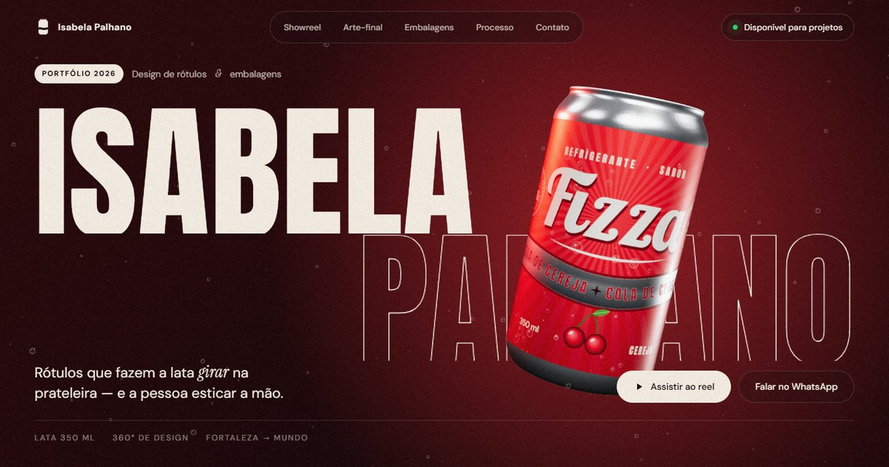

<div align="center">



# 🥤 Isabela Palhano — Design de Rótulos & Embalagens

**Portfólio + showreel 3D de uma designer que desenha cada um dos 360° de uma lata.**

[**▶ Ver o site ao vivo**](https://orghackathons.github.io/isabela/) · [**💬 Falar com a Isabela no WhatsApp**](https://wa.me/5585981488265)

</div>

---

## ✨ O que tem aqui

Um site de uma página só, feito pra parecer um **demoreel** de estúdio: uma lata de alumínio em 3D vai acompanhando o scroll, troca de rótulo, gira, sai de cena e volta pra fechar o contato.

| Seção | O que acontece |
| --- | --- |
| **Hero** | O nome gigante fica *atrás* da lata 3D, que gira sozinha e pode ser **arrastada com o mouse** pra ver o rótulo inteiro. |
| **Sobre** | Manifesto que vai se acendendo palavra por palavra enquanto você rola a página. |
| **Showreel** | A seção fica parada e cada rolagem troca a lata de sabor. O rótulo novo **sobe como refrigerante enchendo a lata**, com espuma na linha da transição, enquanto a lata dá um giro de 360°. O fundo muda de cor com o sabor. |
| **Arte-final** | Rolagem horizontal com as **pranchas técnicas** de cada rótulo: sangria, área de segurança, emenda, marcas de corte e de registro, barras CMYK e paleta. |
| **Além das latas** | Uma garrafa âmbar de kombucha, um pote de mel e uma barra de chocolate, todos em 3D, com rótulos próprios. |
| **Processo** | A lata começa como **rascunho a lápis** (com anotações em caneta vermelha) e vira arte-final enquanto os passos passam. |
| **Contato** | A lata volta com o rótulo **"SUA MARCA AQUI"** em alumínio escovado. Passe o mouse no botão do WhatsApp e o lacre abre, soltando o gás 🫧 |

### A coleção (marcas autorais)

| # | Marca | Sabor | Destaque do rótulo |
| --- | --- | --- | --- |
| 01 | **Fizza** | Cola de cereja | Script retrô, raios de sol, faixa ondulada em alumínio aparente |
| 02 | **Tropik** | Maracujá & manga | Sol poente listrado, folhagem tropical, letras em bloco com extrusão |
| 03 | **Onda** | Energético de açaí | Ondas metálicas sobre roxo, logo com aberração cromática |
| 04 | **Caju Club** | Soda de caju | Xilogravura de cordel, bandeirinhas, mandacaru: o Ceará na lata |
| 05 | **Citra** | Tônica de limão siciliano | Acabamento fosco, serifa elegante, filetes em hot stamping dourado |
| 06 | **Noir** | Cola zero açúcar | Preto soft-touch com foil ouro art déco |

> Todos os rótulos são **gerados por código** (Canvas 2D) em [`js/labels.js`](js/labels.js). Cada um tem frente, laterais e verso completos (tabela nutricional, ingredientes, código de barras, selo de reciclagem e a assinatura *design: Isabela Palhano*), além de um **mapa de material** que avisa ao 3D onde o rótulo é alumínio brilhante, onde é fosco e onde é foil.

---

## 🛠️ Tecnologias

- **[Three.js](https://threejs.org/)** — lata, garrafa, pote e caixa em 3D, com material PBR, reflexos de estúdio e um shader próprio para a transição "líquida" entre rótulos
- **[GSAP + ScrollTrigger](https://gsap.com/)** — coreografia de scroll, seções fixadas e rolagem horizontal
- **[Lenis](https://lenis.darkroom.engineering/)** — rolagem suave
- **Canvas 2D** — geração procedural de todos os rótulos e das pranchas de arte-final
- HTML + CSS + JavaScript puros, **sem etapa de build**: é só publicar.

---

## 📁 Estrutura

```
isabela/
├── index.html          # página única (conteúdo e seções)
├── css/
│   └── style.css       # visual, layout e responsivo
├── js/
│   ├── main.js         # cena 3D, scroll, animações e interações
│   └── labels.js       # gerador dos rótulos + dados da coleção
├── assets/
│   ├── favicon.svg
│   └── og.jpg          # imagem de compartilhamento (WhatsApp, redes sociais)
└── .nojekyll
```

---

## 🚀 Publicar no GitHub Pages

1. Suba os arquivos para a branch `main` deste repositório.
2. No GitHub, abra **Settings → Pages**.
3. Em **Build and deployment**, escolha **Deploy from a branch**, depois a branch **`main`** e a pasta **`/ (root)`**. Clique em **Save**.
4. Em um ou dois minutos o site fica no ar em:
   **https://orghackathons.github.io/isabela/**

## 💻 Rodar localmente

O site usa módulos JavaScript, então precisa de um servidorzinho local (abrir o `index.html` direto no navegador com dois cliques não funciona):

```bash
# na pasta do projeto
python -m http.server 8000
# depois abra http://localhost:8000
```

Ou use a extensão **Live Server** do VS Code.

---

## 🎨 Personalizar

**Trocar o WhatsApp:** procure por `5585981488265` no `index.html` e troque pelo novo número (formato internacional, só dígitos). A mensagem que já vem escrita fica no parâmetro `?text=` do link.

**Criar uma lata nova:**
1. Em [`js/labels.js`](js/labels.js), crie uma função `drawMinhaMarca(c, o)` desenhando no canvas `c` (2048 × 980 px; a frente da lata fica no centro, em `x = 1024`). Use `o` para marcar áreas metálicas/foscas, se quiser.
2. Adicione um item na lista `COLLECTION`, com nome, sabor, descrição, tags, paleta e cores de fundo. Pronto: a lata entra no showreel e na galeria de arte-final.

**Cores e fontes:** as variáveis ficam no topo do [`css/style.css`](css/style.css) (`:root`).

---

## ♿ Acessibilidade & desempenho

- Respeita **`prefers-reduced-motion`**: com ele ativo, rolagem suave, grão e animações contínuas são reduzidos.
- Se o navegador não tiver WebGL, o site continua funcionando e mostra os rótulos planificados como imagem.
- No celular, o 3D usa menos partículas e resolução ajustada.

---

<div align="center">

Feito com carinho (e muito gás) para a **Isabela Palhano** · Fortaleza, CE 🌵

<sub>Fizza, Tropik, Onda, Caju Club, Citra, Noir, Brota, Mel de Aroeira e Cacau Cariri são marcas fictícias, criadas como projetos autorais de portfólio.</sub>

</div>
